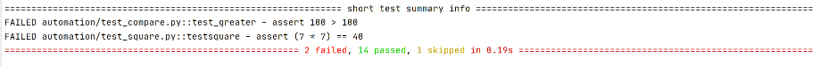
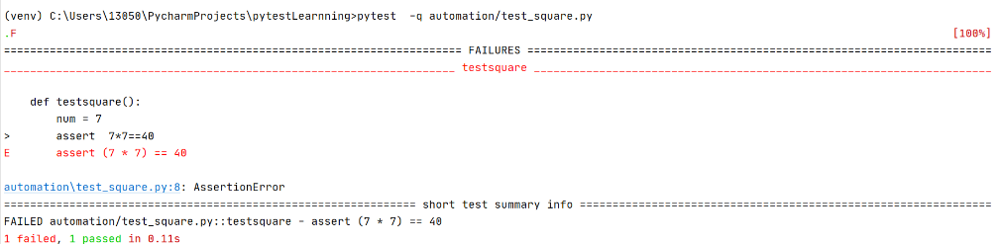
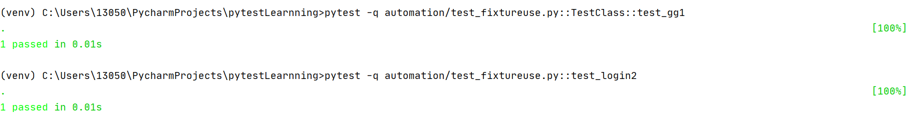
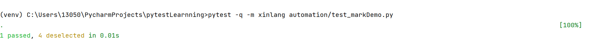
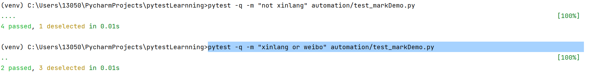
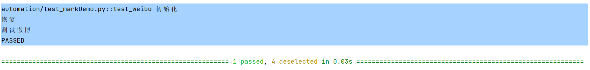
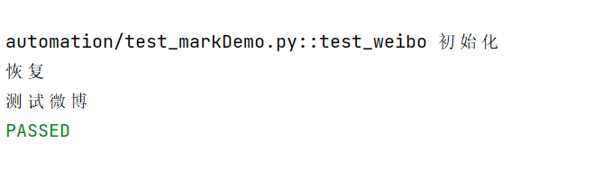
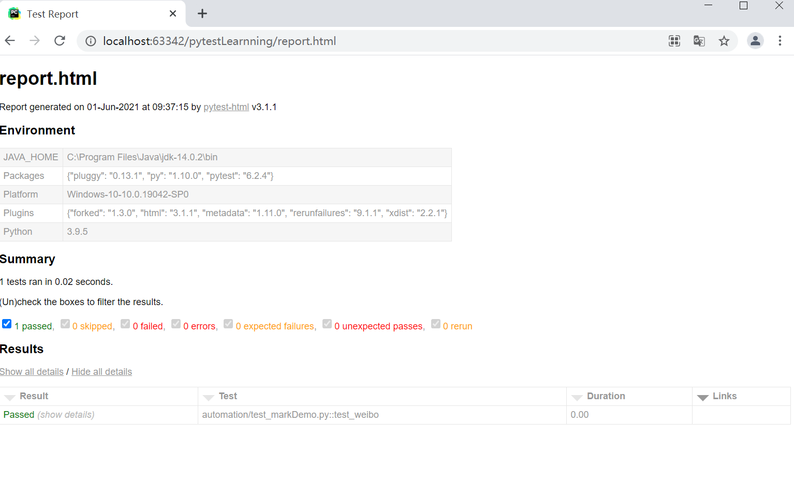

# Pytest<br/>
## 1.pytest用例的执行方 式<br/>
(1)命令行方式直接用pytest执行<br/>
pytest [-vs] [filename]<br/>
-v:显示用例执行的详细信息
[filename]运行指定的文件如果不加默认运行所有命名符合规则的文件。<br/>
Tips:如果只执行 pytest ，会查找当前目录及其子目录下以  test_*.py  或 *_test.py 文件，找到文件后，在文件中找到以  test 开头函数并执行。<br/>
列子:<br/>
<br/>
如果只以pytest执行就会看到所有用例全部被执行。<br/>
<br/>
可以看到我这里加上了具体的文件路径就执行了对应的测试。<br/>
(2)main函数方式<br/>
```python
import pytest

if __name__ == '__main__':
    pytest.main(['-v','automation/test_fixtureuse.py'])

```
(3)在pytest.ini文件中配置textpaths<br/>
pytest默认是搜索执行当前目录下的所有用例，当pytest.ini配置了testpaths = test_case/lxk或testpaths = test_case/lxk/test_001_case.py就会只执行当前配置的文件夹下或文件里的用例，这样我们就可以灵活的控制运行需要测试的用例了，可配置多个，空格隔开<br/>
例子:<br/>
testpaths = automation/test_square.py<br/>

### pytest command扩充 <br/>

运行某个模块里面的某个函数，或者某个类，某个类里面的方法.<br/>
```
pytest -v [filename].py::[TestClass]::[Testmethod]
```
```python
class TestClass():
    flag = 1
    def test_gg1(self):
        print('gg')
    assert flag == 1

def test_login2(login):
    flag = 1
    print('调用login')
    assert flag==1
```


#### -m 标记表达式
```angular2html
pytest -m + [markname] + [filename].py
```
可以通过mark装饰器对特定的用例进行标记。从而达到分组执行用例的效果。
```python
@pytest.mark.weibo
def test_weibo():
    print("测试微博")


@pytest.mark.toutiao
def test_toutiao():
    print("测试头条")


@pytest.mark.toutiao
def test_toutiao1():
    print("再次测试头条")


@pytest.mark.xinlang
class TestClass:
    def test_method(self):
        print("测试新浪")
```


注意这里需要在pytest.ini里定义一下我们的mark标记名字。不然会有告警。
```
[pytest]
markers =
    less:its ok
    xinlang:xinlang
    weibo:weibo
    toutiao:toutiao
```
```
排除一组用例取反在标记名前面加not就可以了
pytest -q -m "not xinlang" automation/test_markDemo.py 
执行多个标记组用 or连接就好
pytest -q -m "xinlang or weibo" automation/test_markDemo.py

```


## pytest  fixture
```
fixture中的重要参数scope决定了操作生效的范围。
scop范围：function ，class ， module ， package 或 session .
```
所有操作都可以写在conftest.py文件里
```python
import pytest
@pytest.fixture()
def  ini():
    print('初始化')
    yield print('恢复')

@pytest.fixture
def  reset():
    yield  print('调用结束回复初始')
```
```
初始化函数会在用例执行前开始运行，yield会在之后开始运行。
命名方式灵活，不局限于 setup 和teardown 这几个命名
conftest.py 配置里可以实现数据共享，不需要 import 就能自动找到fixture
scope="module" 可以实现多个.py 跨文件共享前置
scope="session" 以实现多个.py 跨文件使用一个 session 来完成多个用例
 。
两种操作可以写在一个函数里,也可以分开。至于调用方式直接传参就好了。
pytest -vs  -m weibo automation/test_markDemo.py
```
```python
import pytest

@pytest.mark.weibo
def test_weibo(ini):
    print("测试微博")
```


#### Tips:除了直接传参也可以用mark标记usefixtures加fixturename
```python
import pytest

@pytest.mark.weibo
@pytest.mark.usefixtures('ini')
def test_weibo():
    print("测试微博")
```
```commandline
pytest -vs  -m weibo automation/test_markDemo.py
```


## Pytest的插件
### 失败重跑插件 pytest-rerunfailures
```commandline
环境前提
以下先决条件才能使用pytest-rerunfailures

Python 3.5, 最高 3.8, or PyPy3
pytest 5.0或更高版本

插件安装
pip3 install pytest-rerunfailures
命令行参数：--reruns n（重新运行次数），--reruns-delay m（等待运行秒数）
装饰器参数：reruns=n（重新运行次数），reruns_delay=m（等待运行秒数）
```
### html报告生成插件  pytest html
安装命令行:pip3 install pytest-html<br/>

```commandline
pytest --html=[reportfilename].html
pytest -vs  -m weibo automation/test_markDemo.py  --html=report.html
```


```commandline
合并CSS
上面命令生成的报告，css是独立的，
分享报告的时候样式会丢失，为了更好的分享发邮件展示报告，可以把css样式合并到html里
```
```commandline
pytest --html=report.html --self-contained-html
```