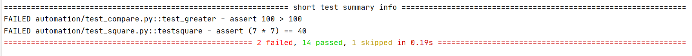

#Pytest
##1.pytest用例的执行方式
(1)命令行方式直接用pytest执行 
pytest [-vs] [filename] 
-v:显示用例执行的详细信息
[filename]运行指定的文件如果不加默认运行所有命名符合规则的文件。 
Tips:如果只执行 pytest ，会查找当前目录及其子目录下以  test_*.py  或 *_test.py 文件，找到文件后，在文件中找到以  test 开头函数并执行。 
列子: 
 
如果只以pytest执行就会看到所有用例全部被执行。 
